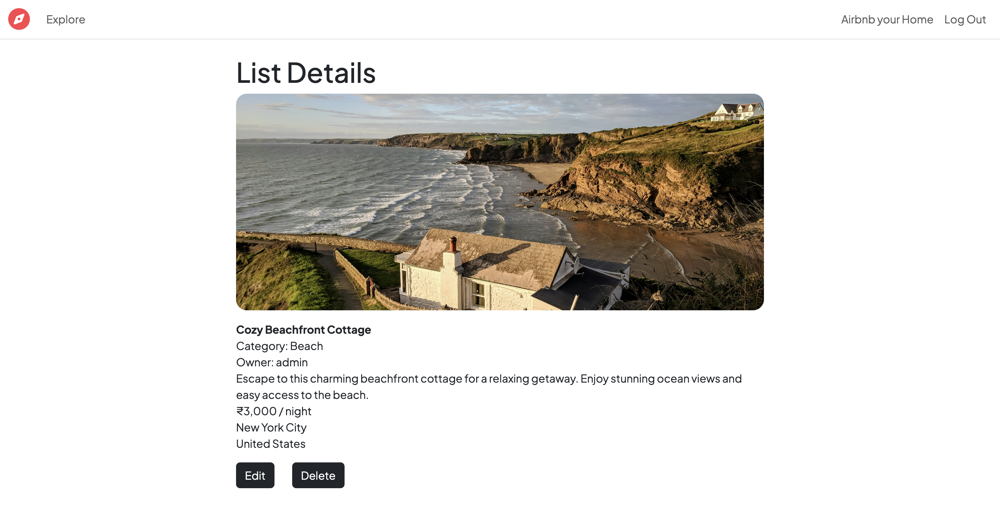
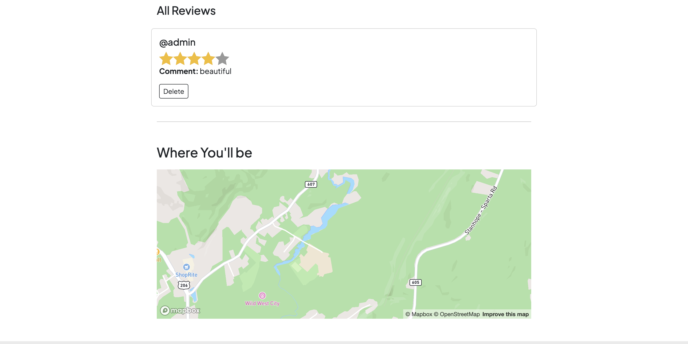
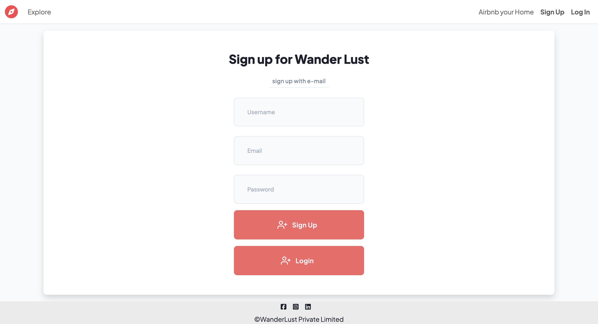
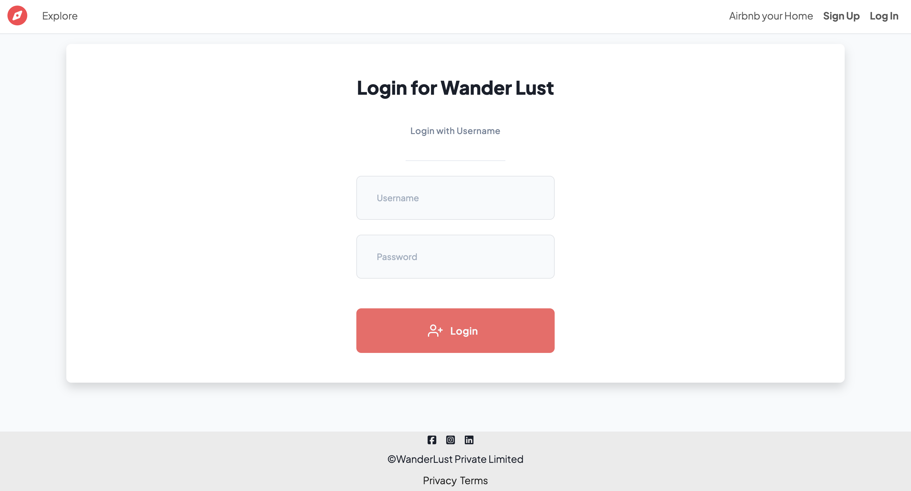
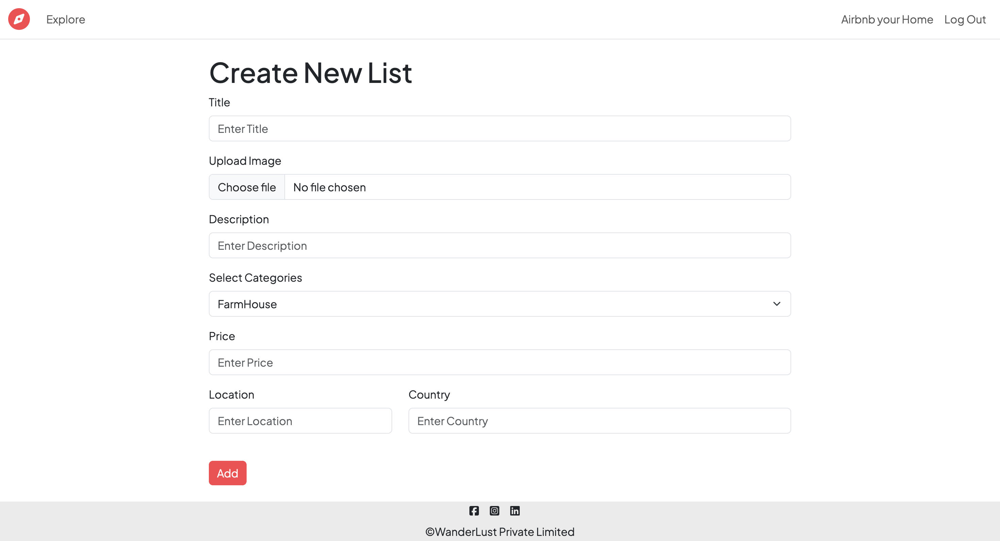

# 🌍 Travello - Full Stack Hotel Listing Platform

A feature-rich, Airbnb-inspired web application that allows users to browse, create, and manage hotel listings with reviews, authentication, and interactive maps. Built using the **MVC architecture** with modern web development practices.

## 📋 Table of Contents
- [Features](#-features)
- [Tech Stack](#-tech-stack)
- [System Architecture](#-system-architecture)
- [Installation](#-installation)
- [Environment Variables](#-environment-variables)
- [Usage](#-usage)
- [API Routes](#-api-routes)
- [Database Schema](#-database-schema)
- [Deployment](#-deployment)
- [Screenshots](#-screenshots)
- [Contributing](#-contributing)
- [License](#-license)
- [Author](#-author)
- [Acknowledgments](#-acknowledgments)
  
## ✨ Features

### Core Functionality
- **User Authentication & Authorization**
  - Secure signup/login with Passport.js
  - Password hashing and salting
  - Session management with MongoDB store
  - Role-based access control

- **Listing Management**
  - Create, read, update, and delete hotel listings
  - Image upload with Cloudinary integration
  - Geolocation with Mapbox API
  - Interactive maps showing listing locations
  - Owner-only edit and delete permissions

- **Review System**
  - Star-based rating system (1-5 stars)
  - User authentication required for reviews
  - Author-only delete functionality
  - Cascading delete with parent listings

- **Advanced Features**
  - Flash messages for user feedback
  - Client-side and server-side validation
  - Error handling with custom error pages
  - Responsive design with Bootstrap 5
  - RESTful API architecture

## 🛠 Tech Stack

### Frontend
- **Template Engine**: EJS (Embedded JavaScript)
- **CSS Framework**: Bootstrap 5
- **JavaScript**: Vanilla JS
- **Maps**: Mapbox GL JS

### Backend
- **Runtime**: Node.js (v20.13.1)
- **Framework**: Express.js
- **Database**: MongoDB with Mongoose ODM
- **Cloud Database**: MongoDB Atlas
- **Authentication**: Passport.js with Passport-Local
- **Session Store**: Connect-Mongo

### Cloud Services
- **Image Storage**: Cloudinary
- **Geocoding**: Mapbox Geocoding API
- **Deployment**: Render

### Development Tools
- **File Upload**: Multer with Cloudinary Storage
- **Validation**: Joi
- **Environment Variables**: dotenv
- **Flash Messages**: connect-flash
- **Template Layouts**: EJS-Mate

## 🏗 System Architecture

This project follows the **MVC (Model-View-Controller)** design pattern:

Travello/
│
├── models/ # Database schemas
│ ├── listing.js # Listing model
│ ├── review.js # Review model
│ └── user.js # User model
│
├── views/ # EJS templates
│ ├── layouts/ # Layout templates
│ │ └── boilerplate.ejs # Main layout
│ ├── includes/ # Partial templates
│ │ ├── navbar.ejs # Navigation bar
│ │ ├── footer.ejs # Footer
│ │ └── flash.ejs # Flash messages
│ ├── listings/ # Listing views
│ │ ├── index.ejs # All listings
│ │ ├── show.ejs # Single listing
│ │ ├── new.ejs # Create listing
│ │ └── edit.ejs # Edit listing
│ ├── users/ # User authentication views
│ │ ├── signup.ejs # Signup form
│ │ └── login.ejs # Login form
│ └── errors/ # Error pages
│ └── error.ejs # Error page
│
├── controllers/ # Business logic
│ ├── listing.js # Listing controller
│ ├── review.js # Review controller
│ └── user.js # User controller
│
├── routes/ # Express routes
│ ├── listingg.js # Listing routes
│ ├── revieww.js # Review routes
│ └── userr.js # User routes
│
├── public/ # Static files
│ ├── css/ # Stylesheets
│ │ └── style.css
│ └── js/ # Client-side scripts
│ └── script.js
│
├── utils/ # Utility functions
│ ├── wrapAsync.js # Async error wrapper
│ └── MyError.js # Custom error class
│
├── init/ # Database initialization
│ ├── data.js # Sample data
│ └── index.js # DB seed script
│
├── middleware.js # Custom middleware
├── cloudconfig.js # Cloudinary configuration
├── schema.js # Joi validation schemas
├── .env # Environment variables
├── package.json # Dependencies
└── index.js # Application entry point

## 🚀 Installation

### Prerequisites
- Node.js (v20.13.1 or higher)
- MongoDB Atlas account
- Cloudinary account
- Mapbox account

### Steps

1. **Clone the repository**
git clone https://github.com/iambuzzz/Travello
cd Project_WanderLust

2. **Install dependencies**
npm install --force

3. **Set up environment variables**
Create a `.env` file in the root directory:
ATLASDB_URL=your_mongodb_atlas_connection_string
SECRET=your_session_secret
CLOUD_NAME=your_cloudinary_cloud_name
CLOUD_API_KEY=your_cloudinary_api_key
CLOUD_API_SECRET=your_cloudinary_api_secret
MAP_TOKEN=your_mapbox_access_token

4. **Initialize database (optional)**
cd init
node index.js

5. **Start the development server**
npm start
or with nodemon:
nodemon index.js

6. **Access the application**
Open your browser and navigate to `http://localhost:8080/listing`

## 🔐 Environment Variables

| Variable | Description |
|----------|-------------|
| `ATLASDB_URL` | MongoDB Atlas connection string |
| `SECRET` | Secret key for session encryption |
| `CLOUD_NAME` | Cloudinary cloud name |
| `CLOUD_API_KEY` | Cloudinary API key |
| `CLOUD_API_SECRET` | Cloudinary API secret |
| `MAP_TOKEN` | Mapbox public access token |

## 📖 Usage

### For Users
1. **Browse Listings**: Visit the home page to see all available hotel listings
2. **View Details**: Click on any listing to see full details, reviews, and location map
3. **Sign Up/Login**: Create an account to add listings and reviews
4. **Add Listing**: After logging in, create your own hotel listings with images and location
5. **Write Reviews**: Rate and review listings you've visited
6. **Manage Your Content**: Edit or delete your own listings and reviews

### For Developers
- **Add New Routes**: Create routes in `/routes` directory
- **Create Controllers**: Add business logic in `/controllers`
- **Define Models**: Add new schemas in `/models`
- **Custom Middleware**: Add middleware functions in `middleware.js`
- **Validation**: Define Joi schemas in `schema.js`

## 🔗 API Routes

### Listing Routes
| Method | Endpoint | Description | Auth Required |
|--------|----------|-------------|---------------|
| GET | `/listing` | Get all listings | No |
| GET | `/listing/new` | Render new listing form | Yes |
| POST | `/listing` | Create new listing | Yes |
| GET | `/listing/:id` | Get single listing | No |
| GET | `/listing/:id/edit` | Render edit form | Yes (Owner) |
| PUT | `/listing/:id` | Update listing | Yes (Owner) |
| DELETE | `/listing/:id/delete` | Delete listing | Yes (Owner) |

### Review Routes
| Method | Endpoint | Description | Auth Required |
|--------|----------|-------------|---------------|
| POST | `/listing/:id/reviews` | Add review to listing | Yes |
| DELETE | `/listing/:id/reviews/:reviewId` | Delete review | Yes (Author) |

### User Routes
| Method | Endpoint | Description |
|--------|----------|-------------|
| GET | `/signup` | Render signup form |
| POST | `/signup` | Register new user |
| GET | `/login` | Render login form |
| POST | `/login` | Authenticate user |
| GET | `/logout` | Logout user |

## 🌐 Deployment

This project is deployed on **Render** with MongoDB Atlas as the database.

### Deployment Steps

1. **Prepare for deployment**
   - Ensure all environment variables are set
   - Test locally before deploying
   - Push code to GitHub

2. **Configure Render**
   - Connect GitHub repository
   - Set build command: `npm install --force`
   - Set start command: `node index.js`
   - Add environment variables in Render dashboard

3. **Configure MongoDB Atlas**
   - Whitelist Render IP addresses in Network Access
   - Get connection string and add to environment variables

4. **Deploy**
   - Manual deploy or enable auto-deploy from GitHub

**Live Demo**: [https://project-wanderlust-02oq.onrender.com](https://project-wanderlust-02oq.onrender.com)

## 📸 Screenshots

<table>
  <tr>
    <td width="50%">
      <h3 align="center">Home Page - View 1</h3>
      

        
      

    </td>
    <td width="50%">
      <h3 align="center">Home Page - View 2</h3>
      

        
      

    </td>
  </tr>
  <tr>
    <td width="50%">
      <h3 align="center">Listing Details - Part 1</h3>
      

        
      

    </td>
    <td width="50%">
      <h3 align="center">Listing Details - Part 2</h3>
      

        
      

    </td>
  </tr>
  <tr>
    <td width="50%">
      <h3 align="center">User Signup</h3>
      

        
      

    </td>
    <td width="50%">
      <h3 align="center">User Login</h3>
      

        
      

    </td>
  </tr>
  <tr>
    <td width="50%">
      <h3 align="center">Create New Listing</h3>
      

        
      

    </td>
    <td width="50%">
      <h3 align="center">Edit Listing</h3>
      

        
      

    </td>
  </tr>
</table>

## 🤝 Contributing

Contributions are welcome! Please follow these steps:

1. Fork the repository
2. Create a feature branch (`git checkout -b feature/AmazingFeature`)
3. Commit your changes (`git commit -m 'Add some AmazingFeature'`)
4. Push to the branch (`git push origin feature/AmazingFeature`)
5. Open a Pull Request

## 📝 License

This project is licensed under the MIT License - see the LICENSE file for details.

## 👨‍💻 Author

**Ambuj Jaiswal**
- GitHub: [@iambuzzz](https://github.com/iambuzzz)
- Email: ambujjais1@gmail.com

## 🙏 Acknowledgments

- Bootstrap for UI components
- Mapbox for mapping services
- Cloudinary for image hosting
- MongoDB Atlas for cloud database
- Render for deployment platform

---

⭐ If you found this project helpful, please consider giving it a star!

